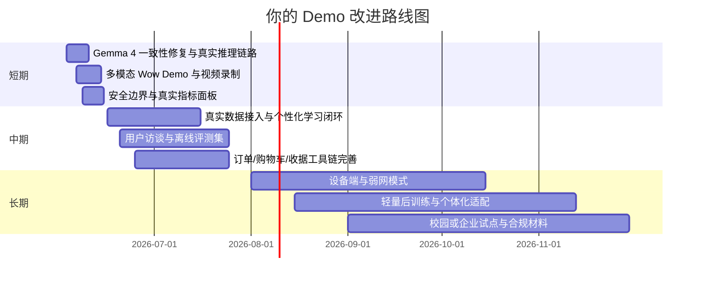
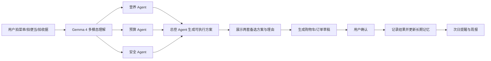

# 基于 Gemma 系列与相关 AI Agent 大赛的对标研究报告

## 执行摘要

截至 **2026 年 6 月 2 日**，我检索到的 **Gemma 4 Good Hackathon** 官方可见资料重点仍集中在赛事页、欢迎帖与讨论区，而公开搜索结果里可见 “Regarding Winner Announcements...” 讨论主题；我**没有找到可核验的官方 Gemma 4 获奖名单公告**。因此，本报告不臆造“Gemma 4 往届获奖作品”，而是采用更稳妥的对标框架：以 **Gemma 4 当前官方评审导向** 为目标约束，再回看 **Gemma 3n Impact Challenge、Unlock Global Communication with Gemma、Gemini API Developer Competition、ADK Hackathon、MedGemma Impact Challenge** 等近两三年官方同生态赛事的获奖项目与评审信号。Gemma 4 官方公开信息反复强调：**advanced reasoning、agentic workflows、function calling、多模态、设备端/本地优先**，而赛事页进一步突出 **“wow factor”** 和 **视频故事表达**。citeturn19search3turn33search1turn33search2turn24search0turn24search4

从这些官方获奖案例看，胜出的项目几乎都不是“大而全通用助手”，而是对一个**真实、具体、可验证的痛点**进行深钻：例如 **Gemma Vision** 用胸前相机+手柄/语音让盲人真正“免手持”使用；**VITE VERE / Vite Vere Offline** 用拍照→简化步骤→语音播报帮助认知障碍用户做日常任务；**3VA** 通过个体化微调，让脑瘫用户从简单 pictogram 输出更丰富、更像“自己的声音”的表达；**Jayu** 则把 Gemini 与屏幕上下文和函数调用结合，形成可操作的个人助理。评审更看重的是：**真实用户、完整闭环、可演示行动、技术与场景强耦合、清晰边界与安全说明**，而不仅是“我有一个 agent 框架”。citeturn4view0turn13view0turn13view1turn14view1turn11view0turn31view0

基于你上传的代码包静态审阅，我的总体判断是：你的方向 **“基于 Gemma 4 的营养成分与开销伴随智能体”** 本身很有比赛潜力，尤其适合打 **“健康价值 + 预算公平性 + 长期陪伴”** 的复合叙事；但**当前实现更像一个参赛 MVP scaffold，而不是已达到获奖水准的成品**。它已经具备“长期记忆、提醒、自动搭配、下单草稿、周模拟、仪表盘”的雏形，也有叙事文档与 demo script，这些对比赛很有帮助；但在关键得分点上仍有明显短板：**Gemma 4 一致性证明不足、真实工具闭环不足、数据与指标偏模拟、域范围过窄、隐私/安全/合规呈现不足、可验证用户研究不足**。这些问题在 Gemma 4 / AI agent 评审语境下，会直接影响 **技术可信度、演示说服力和真实影响力**。

如果你要把这个项目推到“能显著拉升评审分数”的状态，最有效的路线不是继续堆功能，而是做四件事：第一，**把“Gemma 4”从概念变成可证据化的实现**；第二，**把“陪伴”从静态规则提升为可解释、可验证的个性化闭环**；第三，**把“营养+开销”从麦当劳 mock 场景扩展为真实饮食决策流**；第四，**把 demo 从功能演示升级为“真实用户故事 + 可量化改善结果 + 安全边界”**。从比赛经验看，这种收敛式改造，比盲目增加更多页面或更多 agent，更能提高入围与获奖概率。citeturn24search0turn24search4turn31view0turn8view0

## 研究范围与资料说明

本报告优先使用了 **Google / Google DeepMind / Google AI for Developers / Google Cloud / Kaggle / Devpost** 等官方或主办方页面，其次使用了获奖项目的原始项目页。由于部分 Kaggle 页面为动态加载，公开可抓取文本不总能给出完整的逐条 judge comment，因此表中的“评审理由”主要依据三类材料综合提炼：**奖项名称本身、主办方获奖公告中的官方描述、项目原始页的功能与技术陈述**。换句话说，下面的“评审理由”不是我主观猜测，而是对官方材料的汇总与归纳。citeturn4view0turn1view2turn11view0turn31view0turn27view0

就“Gemma 4 / 相关 AI agent 赛道”而言，近三年的官方材料呈现出一个非常清晰的演变方向：**Gemini API 竞赛** 更偏“AI 应用创新”，**ADK Hackathon** 明确转向“多 agent 协作与编排”，**Gemma 3n / MedGemma / Gemma 4** 则进一步把评审重心推向 **本地优先、离线可用、多模态输入、实用工具调用、可落地的社会影响**。这也是你项目最该借力的背景。citeturn11view0turn31view0turn19search10turn19search3

### 赛事与资料边界总览

| 年份 | 赛事 | 纳入原因 | 当前可用公开材料 | 说明 | 来源 |
|---|---|---|---|---|---|
| 2026 | Gemma 4 Good Hackathon | 你的目标场景最接近；直接决定 Gemma 4 参赛标准 | 赛事页、欢迎帖、讨论区、公开写作说明；强调 wow factor 与视频故事 | 截至 2026-06-02，我未检索到可核验的官方获奖名单，故以**评审导向**对标 | citeturn24search0turn24search4turn2search10 |
| 2025 | Gemma 3n Impact Challenge | Gemma 系列最近一届有完整官方获奖公告；非常接近“设备端/多模态/社会影响” | 官方开发者博客完整获奖文 | 可直接观察什么样的 Gemma 项目最容易赢 | citeturn4view0 |
| 2024/2025 | Unlock Global Communication with Gemma | 展示 Gemma 系列在数据策展、微调、可复现实验上的获奖范式 | 官方公告、原始 Kaggle Notebook 页 | 对“技术深度”与“可复用方法”很有参考价值 | citeturn20search3turn1view2 |
| 2025 | Agent Development Kit Hackathon with Google Cloud | 近年最直接的“AI agent 赛道”官方范本 | 官方规则、评审标准、获奖公告、Devpost 项目页 | 明确给出了技术实现/创新/演示文档的评分维度 | citeturn31view0turn8view0 |
| 2024 | Gemini API Developer Competition | 直接提供“产品化 AI 应用如何得奖”的大样本 | 官方获奖总表与各项目原始页 | 辅助理解“有用、可信、可被普通评委理解”的应用长什么样 | citeturn22search0turn11view0 |
| 2026 | MedGemma Impact Challenge | 虽非 Gemma 4，但属于 Google 开放模型家族高质量影响力赛事 | 官方获奖公告与 special technology winners | 对“健康场景如何讲 impact + 安全 + agentic workflow”极有启发 | citeturn27view0 |

### 资料局限

- Gemma 4 比赛的**官方获奖名单尚不可核验**，因此本报告只能基于现有公开规则与历史同类赛事推断其偏好。citeturn24search0turn2search10
- Kaggle 个别原始页面可公开搜索到标题和摘要，但不一定能完整抓取全文；因此表格中若写“团队未公开明确”，表示我选择**保守不补全**。citeturn15search0turn16search0turn18search0
- 对你 demo 的判断来自**你上传代码包的静态审阅**；你未提供 live demo、演示视频、线上地址、用户测试记录或真实评审反馈，因此这部分属于“静态实现评估”，不是线上运行验证。

## 获奖作品清单

先给出一句最关键的判断：如果你的目标是 **Gemma 4 / agentic 类比赛**，最该重点看的是两类项目。一类是 **Gemma Vision / Vite Vere Offline / 3VA / LENTERA / Dream Assistant** 这种“真实人群、离线优先、可感知社会价值”的 Gemma 生态项目；另一类是 **Jayu / SalesShortcut / Edu.AI / GreenOps** 这种“工具调用明确、agent 协作清晰、可完成实际任务”的应用与 agent 项目。前者定义“为什么值得做”，后者定义“怎么让评委相信它真能做成”。citeturn4view0turn13view1turn30view0turn30view3turn30view2

### Gemma 系列与开放模型相关赛事代表获奖项目

| 年份 | 赛事 / 奖项 | 项目名 | 团队 | 技术栈 | 关键功能 | 官方评审理由或官方描述要点 | 对你可复用的点 | 来源 |
|---|---|---|---|---|---|---|---|---|
| 2025 | Gemma 3n Impact Challenge 一等奖 + Google AI Edge Prize | Gemma Vision | Tommaso Giovannini | Gemma 3n、MediaPipe LLM Inference API、flutter_gemma、设备端部署 | 盲人视觉辅助；胸前相机；语音/手柄触发；免手持交互 | 官方强调其由真实盲人用户深度参与、交互设计贴近真实使用姿势、设备端部署流畅、社会影响强 | 你的项目可引入“真实生活约束驱动的交互设计”，例如走路/上课/食堂排队中的单手/免手操作 | citeturn4view0turn5search6 |
| 2025 | Gemma 3n Impact Challenge 二等奖 | Vite Vere Offline | 官方公告未明确 | Gemma 3n、本地 TTS、离线工作流 | 图像转简化步骤并播报，用于认知障碍用户日常任务支持 | 官方突出“把已有产品迁移为离线 companion”，更强的可用性和自主性 | 你的“吃饭提醒+预算控制+下单建议”应做成离线/弱网可用，而不是只在云端聊天 | citeturn4view0 |
| 2025 | Gemma 3n Impact Challenge 三等奖 | 3VA | 官方公告未明确 | Gemma 3n、Apple MLX、本地个体化微调 | 将 pictogram 转成更丰富、更像用户本人的表达 | 官方突出“个体化微调”“成本可接受”“让技术表达人的真实声音” | 你的项目可以做“个人饮食风格 / 偏好表达”的个体化 adapter，而不是只做规则推荐 | citeturn4view0turn18search6 |
| 2025 | Gemma 3n Impact Challenge 四等奖 | Sixth Sense for Security Guards | 公开摘要显示为 Abylay Ospan、Alsu Ospan | Gemma 3n、YOLO-NAS、实时视频管线 | 安防视频理解，区分普通事件和威胁 | 官方突出“先用轻量检测再交给 Gemma 做高层语义判断”，既快又实用 | 你的饮食 agent 可采用“轻量规则/OCR 预筛 + Gemma 4 高层决策”的双层架构，降成本、增可靠性 | citeturn4view0turn18search6 |
| 2025 | Gemma 3n Impact Challenge Unsloth Prize | Dream Assistant | 官方公告未明确 | Gemma 3n、Unsloth、个体语音微调 | 识别个体化 speech pattern 的语音助手 | 官方强调“对单一用户的真实可用性”而非泛化炫技 | 你可做“个体化提醒语气/预算容忍度/偏好学习”的低成本微调或 adapter | citeturn4view0turn15search1 |
| 2025 | Gemma 3n Impact Challenge Ollama Prize | LENTERA | 官方公告未明确 | Gemma 3n、Ollama、离线微服务器 | 为断网地区提供本地教育 AI hub | 官方突出“可达性、低成本硬件、离线部署” | 你的项目若能在校园 kiosk、老人机、边缘设备上跑，会比纯网页助手更有差异化 | citeturn4view0turn15search2 |
| 2025 | Gemma 3n Impact Challenge LeRobot Prize | Graph-based Cost Learning and Gemma 3n for Sensing | 官方公告未明确 | Gemma 3n、LeRobot、IGMC | 先预测 sensing latency，再规划动作，提高机器人探索效率 | 官方强调“把 Gemma 放进完整 embodied pipeline，而非单点问答” | 你也应该把 Gemma 4 放进完整「识别—规划—执行—验证」链路，而非只输出建议文本 | citeturn4view0turn16search1 |
| 2025 | Gemma 3n Impact Challenge NVIDIA Jetson Prize | My Jetson Gemma | 官方公告未明确 | Gemma 3n、Jetson、离线语音界面 | 上下文感知、离线、隐私保护的本地语音助手 | 官方突出“在真实物理环境中的响应性与隐私” | 你的项目如果面向在外吃饭/买菜，应把“本地隐私”作为关键卖点 | citeturn4view0turn15search3 |
| 2024/2025 | Unlock Global Communication with Gemma 一等奖 | Gemma 2 Swahili | alfaxadeyembe | Gemma 2 2B/9B/27B、PEFT 微调 | Swahili 理解与生成 | 官方强调多尺寸 PEFT、instruction 格式灵活、面向 2 亿+ 说话者 | 你可借鉴“多尺寸实验 + 小规模高质量调优”，先做能打样的 Gemma 4 E4B/E2B 版本 | citeturn1view2turn21search0 |
| 2024/2025 | Unlock Global Communication with Gemma 官方特写 | Kyara | zake7749 | 检索增强、图式知识检索、Q&A 数据构建 | 提升繁中问答微调质量 | 官方强调“高质量数据构建比盲目训练更重要” | 你最需要先补的是“饮食-预算-偏好”高质量样本与评测集，而不是先上更复杂 agent | citeturn1view2turn21search1 |
| 2024/2025 | Unlock Global Communication with Gemma 官方特写 | ArGemma | tahaalselwii | Gemma 微调、阿拉伯语多任务适配 | 翻译、摘要、故事、对话 | 官方强调任务桥接能力与历史/现代语体兼容 | 你可把“用户饮食日志、商品信息、提醒语句、预算解释”做成多任务联合训练 | citeturn1view2turn21search2 |
| 2024/2025 | Unlock Global Communication with Gemma 官方特写 | Post-Training Gemma for Italian and beyond | anakin87 | 后训练、LLM-as-a-judge、翻译指令数据集 | 低成本提升意大利语能力并减少错觉/灾难性遗忘 | 官方强调“便宜、有效、可复现”的 post-training recipe | 你可以做“个性化营养解释 + 开销建议”轻量后训练，而不是从零训练大模型 | citeturn1view2turn21search3 |
| 2026 | MedGemma Impact Challenge Special Technology | CaseTwin | 官方公告未明确 | MedGemma、agentic workflow | 用病例 twin 匹配加速转诊 | 官方专门把它归为“agentic workflow”改进方向 | 你可以做“历史饮食 twin / 消费 twin 匹配”，提升推荐解释性与说服力 | citeturn27view0 |
| 2026 | MedGemma Impact Challenge Special Technology | ClinicDX | 官方公告未明确 | 微调 MedGemma、OpenMRS、离线查询多份 WHO/MSF 指南 | 离线临床 AI，面向撒哈拉以南地区 | 官方强调“离线、内嵌工作流、知识依据明确” | 你的项目可把营养建议锚定到权威膳食指南，而不是只靠模型口头解释 | citeturn27view0 |

### AI Agent 赛道代表项目

| 年份 | 赛事 / 奖项 | 项目名 | 团队 | 技术栈 | 关键功能 | 官方评审理由或官方描述要点 | 对你可复用的点 | 来源 |
|---|---|---|---|---|---|---|---|---|
| 2024 | Gemini API Developer Competition 年度最佳应用 | Jayu | Jayu | Gemini Flash/Pro、多模型编排、函数调用、屏幕上下文、对象检测 | 可读取屏幕并与界面交互的个人助理 | 项目页突出“屏幕即上下文”“函数调用与视觉分析结合”“安全边界清晰” | 你的 agent 最该学的是“可执行动作 + 有边界的工具调用”，例如购物车/账单/提醒/日历/外卖 API | citeturn11view0turn13view1 |
| 2024 | Gemini API Developer Competition 影响最大 / 人气奖 | VITE VERE | Guido Marangoni | Flutter、Google Cloud TTS、Gemini | 拍照→个性化指引→语音播报 | 官方类别本身已经说明它在“impact”上胜出；原始页强调简单交互、3x3 分步结构、真实辅助价值 | 你的方案也应把复杂营养建议拆成“今天这顿就做这 3 步”，不要只给长文本 | citeturn11view0turn14view0 |
| 2024 | Gemini API Developer Competition 最实用 / 最佳 Flutter | Prospera | Leon Kukuk、Max Hasenohr | Flutter、多模态音频处理、CRM 工作流 | 销售通话实时辅导、会后总结、待办与邮件草稿 | 原始页显示其强项在“实时辅助 + 事后复盘 + 历史追踪”是完整生产闭环 | 你的项目可做成“饭前提醒 + 点餐时建议 + 饭后反馈 + 周复盘”的完整周期闭环 | citeturn11view0turn13view2 |
| 2024 | Gemini API Developer Competition 最佳 Android | Gaze Link | Xiangzhou Sun | Android、Firebase、Google ML Kit、Gemini 1.5 Flash、OpenCV | 眼动输入 + 关键词扩展，帮助 ALS 用户交流 | 原始页给出很强的量化证据：节省 85% 键击、效率提升 7 倍 | 你必须准备类似“超支下降多少、蛋白质达标天数提高多少、提醒响应率多少”的量化指标 | citeturn11view0turn14view1 |
| 2024 | Gemini API Developer Competition 最佳 Web | ViddyScribe | The Accessibros | Web、视频理解、时间戳描述生成、TTS | 自动给视频加音频描述，提高无障碍性 | 原始页的亮点在于“把一项昂贵复杂流程自动化”，而非单纯陪聊 | 你的项目要证明它减少了找餐、算营养、控预算的实际时间成本 | citeturn11view0turn14view2 |
| 2025 | ADK Hackathon Grand Prize | SalesShortcut | Sergazy Nurbavliyev、Merdan Durdyyev | google-adk、Vertex AI、Pub/Sub、Cloud Run、Twilio、Google Maps、A2A SDK | 自动 lead 研究、报价、外呼等 SDR multi-agent 系统 | 官方公告强调其“多 agent 架构 + 真实业务自动化”；项目页展示完整 cloud/tooling 栈 | 你若想打高分，应展示“方案生成—下单草稿—人工确认—下单—记账—学习”的全链路自动化 | citeturn8view0turn30view0 |
| 2025 | ADK Hackathon 拉美区域冠军 | Edu.AI | Giovanna Moeller | ADK、FastAPI、Next.js、Cloud Vision、Google Cloud、SQL | 作文批改、学习路径、模考、闪卡、进度面板 | 项目页的优势是“单一人群、极强场景贴合、多个专职 agent 协作但用户体验很清楚” | 你的营养 agent 也要避免“每个 agent 都露出”，而是让用户只看见一个清晰结果面板 | citeturn8view0turn30view3 |
| 2025 | ADK Hackathon 亚太区域冠军 | GreenOps | Aishwarya Nathani、Nikhil Mankani | Google ADK、云成本/碳排分析、多 agent 编排 | 审计、预测、优化云资源的 AI team | 项目页展示“总控 agent + 专职子 agent + 报告产物”结构 | 你的项目可把“营养 agent、预算 agent、提醒 agent、点单 agent”做成可解释协同，而非并列模块墙 | citeturn8view0turn30view2 |
| 2025 | ADK Hackathon 北美区域冠军 | Energy Agent AI | David Babu | ADK、BigQuery、GCS、Gemini、Cloud Run、XGBoost、SHAP | 个性化客户管理；以模型预测+解释驱动行动 | 项目页显示“不是只预测，而是解释并转成个性化行动” | 你的项目也应把“为什么推荐这顿”解释成预算、蛋白质、时间压力三条清晰因果链 | citeturn8view0turn30view1 |

## 获奖共性与成功要素

**真实痛点必须比技术名词更先被评委理解。**  
Gemma 4 当前官方材料直接说“我们要看到 wow factor”，同时欢迎帖也提醒参赛者“talk to real users”“tell a story”；Gemma 3n、Gemini API、ADK 各类获奖项目也都体现了这一点：它们先讲“盲人如何使用手机”“ALS 患者怎样更快表达”“认知障碍用户怎样独立完成任务”“销售代表怎样在每次通话中得到指导”，然后才讲模型与框架。评委不缺技术震撼，缺的是**技术与具体人的关系**。citeturn24search0turn24search4turn4view0turn11view0turn31view0

**真正的获奖 agent，几乎都不是“会聊天”，而是“会完成任务”。**  
Jayu 会看屏幕、点按钮、调用模型；SalesShortcut 会生成提案、做 outreach；Prospera 既能实时辅导，也能会后产出总结和 follow-up；CaseTwin 不是做医疗闲聊，而是缩短转诊流程。也就是说，得奖项目的核心不是回答得多聪明，而是**能把用户从 A 点带到 B 点**。这对你尤其重要：营养伴随智能体若只是“推荐吃什么”，不会强；若能完成 **识别食物/预算状态 → 给出理由充分的组合 → 生成订单/购物车草稿 → 人工确认 → 追踪结果 → 下次更准**，才更像获奖项目。citeturn13view1turn13view2turn30view0turn27view0

**技术深度不是堆组件，而是把模型能力放在正确的位置。**  
Sixth Sense 不是直接让 Gemma 处理所有视频，而是先用 YOLO-NAS 做轻量检测，再把高价值片段送给 Gemma；Unlock Global Communication 获奖项目则说明，很多时候真正拉开差距的不是更大的模型，而是**更好的数据构建、后训练和评测设计**；Tunix 竞赛获奖方案进一步证明，小模型也能通过 SFT + SimPO/GRPO + 合理 reward 设计获得强 reasoning 特性。对你的项目而言，最有效的“技术深度”未必是增加更多 agent，而是：**膳食 OCR/图像识别前处理、个体偏好建模、工具调用保护、轻量后训练、真实评测集**。citeturn4view0turn1view2turn28view0

**本地优先、离线可用、隐私清晰，是 Gemma 生态的高分项。**  
Gemma 3n 官方定义里就强调 privacy-first、offline-ready、多模态；获奖项目中，Vite Vere Offline、LENTERA、My Jetson Gemma、ClinicDX 都在用这一点构建差异化。Gemma 4 官方又把 on-device / edge / function calling / agentic workflows 明确写进模型定位。你的主题天然涉及饮食、预算与可能的健康信息，这正是**最适合讲隐私与本地优先价值**的场景之一。若继续只做云端 mock 聊天式应用，会浪费 Gemma 系列真正的竞争优势。citeturn19search10turn4view0turn19search9turn33search1turn33search2

**演示材料本身就是评审对象，而不是附属品。**  
Gemma 4 赛事公开材料明确把视频故事和 “wow” 感放在前面；Gemma 3n 开赛公告也提到要“compelling video story”和“wow factor demo”；ADK Hackathon 进一步明确把 Demo and Documentation 列为评分项，并要求架构图、项目描述、可安装与可运行。换言之，**PPT、视频、架构图、指标面板、真实演示流** 不是包装，而是分数本体。citeturn24search0turn1view1turn31view0turn9view1

**安全边界写清楚，比“无所不能”更得分。**  
Jayu 在原始页里明确申明：只在直接提示下查看屏幕，不保留图像或录音，不越权访问未展示的应用；VITE VERE 也写明其是辅助工具，不替代家庭与专业机构。对健康/营养项目尤其如此。评委通常不怕你能力少，怕你**边界不清、过度承诺、没有人类确认点**。你的项目如果加入“非医疗建议、下单需确认、过敏/禁忌/预算冲突提示、数据本地优先、可删除历史”的明示，会明显提升信任感。citeturn13view1turn14view0

## 你的 Demo 评估与假设

### 你已提供与未提供的材料

| 项目 | 状态 | 我如何处理 |
|---|---|---|
| 代码包 | **已提供**：`eatornot-feat-init-mvp-scaffold.zip` | 已做静态代码审阅 |
| Demo 访问地址 | **未提供** | 不做在线可运行验证 |
| 演示视频 | **未提供** | 不评估镜头语言、节奏与现场稳定性 |
| 功能清单 | **未单独提供** | 以你的自然语言描述 + 代码实现为准 |
| 用户研究 / 试点数据 | **未提供** | 不把“impact”当作已被证实，只视作潜力 |
| 论文 / 评审反馈 | **未提供** | 不做学术或正式评审复盘 |
| 真实外卖/商超/支付接入 | **未提供明确证据** | 按代码中 mock / 草稿状态评估 |

### 我在评估时采用的关键假设

| 假设 | 理由 | 对结论的影响 |
|---|---|---|
| 你的参赛目标更接近 **Gemma 4 Good Hackathon** 或类似 AI agent 赛道 | 你明确强调 Gemma 4、agent、社会价值与 demo 评审 | 我会优先按“影响力 + 演示 + agent 完整性”来打分 |
| 你希望项目主题是“营养 + 开销 + 伴随式代理”而不是“麦当劳点餐助手” | 你的自然语言描述明显高于当前代码域范围 | 代码里偏麦当劳/快餐的限制被视为当前短板，而非最终产品定义 |
| 代码包是当前可评估的主要事实依据 | 未提供 live demo 与视频 | 我更关注结构、闭环、稳定性风险，而不是 UI 美观分 |
| 你尚未形成正式 pilot 数据 | 代码中已有模拟周报和指标逻辑 | 我会把现有指标视为“演示占位”，不会当作真实成效证据 |

### 当前完成度判断

如果只看项目想法，你的方案非常适合比赛：**“让用户在真实饮食决策里，同时把营养、预算、时间压力、口味偏好和提醒执行统一到一个 agent 里”**，这是一个有明确日常频次、有商业想象、也有健康价值的方向。更重要的是，它不是泛泛的“健康助手”，而是可以走到 **“可执行动作”** 的题目——推荐、替换、提醒、下单、记账、周追踪，这些都天然适合 agent 化。

但如果严格按当前代码实现来评估，它仍处在 **“有完整故事的 MVP 骨架”** 阶段，而不是“能赢的完成品”。我看到的优点，是你已经不是单纯聊天页面：你有 profile、memory、reminder、auto-draft、dashboard、feedback、demo story、demo script、judging story，这说明你其实已经在往“比赛叙事”而不是“技术 demo”方向走了，这是对的。

问题在于，当前实现离获奖项目还有一条比较明显的鸿沟：**获奖项目往往能证明它在一个真实场景里真的工作，并且把模型能力放进了一个可信的、可演示的、可量化的闭环**；而你现在更接近“把这些闭环的页面和后端接口先搭出来了”。这会导致评委在看完后形成这样的印象：**方向好、意识好、结构好，但证据还不够硬。**

### 具体不足与它们如何影响评审得分

| 具体不足 | 我在代码中看到的表现 | 影响的评审维度 | 可能如何影响得分 |
|---|---|---|---|
| **Gemma 4 一致性不足** | 配置默认写的是 `gemma-4-31b-it`，但 ADK 代理层仍出现 `gemini-2.0-flash` 的硬编码路径；会给人“项目名义上是 Gemma 4，实际链路未完全统一”的感觉 | 技术可信度、赛事合规性、答辩一致性 | 评委一问“哪里真正用了 Gemma 4”，如果回答含糊，会被视为包装大于实现 |
| **真实工具闭环不足** | 下单更多是草稿/模拟链路；Provider 默认走 mock；很多接口围绕 demo-user 和 mock 数据组织 | 技术执行、真实可用性、wow factor | 评委会认为这是“可点击 demo”，不是“可完成任务的 agent” |
| **指标可信度不足** | demo metrics 中存在硬编码前后值与固定采纳率；周模拟由预设 timeline 生成 | 影响力证明、数据可信度、商业化说服力 | 一旦被问“这些改善数据来自哪里”，很容易失分 |
| **真实个性化较弱** | memory 更接近基于近 30 天记录的频次与规则推断，而不是更稳健的个体建模 | 产品深度、长期陪伴可信度 | 评委可能觉得“记忆是有了，但学习还不够聪明” |
| **多模态能力没有形成主卖点** | 当前代码主路线仍偏文本+菜单决策；缺少“拍食物/拍菜单/识别收据/语音说需求”式 Wow Moment | Gemma 4 适配度、演示吸引力 | Gemma 4 明明强调多模态与 agentic workflow，你却没有把最容易出彩的能力打出来 |
| **域范围过窄** | 当前饮食数据主要围绕 mock 麦当劳菜单展开 | 业务可扩展性、真实影响力 | 评委会质疑“这是饮食伴随 agent，还是快餐替换器？” |
| **部分逻辑仍有明显工程风险** | 存在深夜提醒条件永远不成立的逻辑；下单确认后记录餐次的内部函数引用不完整 | 技术实现、现场稳定性 | 现场 demo 一旦被点到，容易暴露“看起来能跑，实际不稳” |
| **安全/隐私/合规呈现不足** | 有过敏检查与 reset，但暂无完整授权、数据删除、隐私策略、非医疗声明、未成年人/敏感健康场景边界呈现 | 安全与隐私、评委信任 | 健康和预算数据都敏感，如果边界不清，评委会更保守 |

### 以比赛视角给你的当前成熟度估计

| 维度 | 当前估计 | 判断理由 |
|---|---|---|
| 题目选择 | **强** | 营养 + 预算 + 伴随 agent 是高频刚需，且叙事空间大 |
| 技术方向 | **中上** | 已经具备 agent、记忆、提醒、仪表盘、草稿下单等模块化意识 |
| 技术完成度 | **中下** | mock 依赖较重，Gemma 4 统一性与真实 action loop 还不够硬 |
| 演示潜力 | **强** | 文档齐全，故事线天然适合比赛视频 |
| 真实影响力证据 | **弱** | 目前更像模拟结果，不是 pilot 结果 |
| 安全与隐私 | **中下** | 有意识，但离评委想看到的“边界声明 + 保护机制”还有距离 |
| 获奖潜力 | **若立刻参赛：中等偏下；按本报告改造后：中上到强** | 决定性变量不是再多一个功能，而是把证据链补齐 |

## SWOT 分析

| 维度 | Strengths | Weaknesses | Opportunities | Threats |
|---|---|---|---|---|
| 技术 | 已有多 agent / 多服务骨架；有 profile、memory、reminder、dashboard、feedback 等完整模块意识 | Gemma 4 真实使用链路不够统一；mock 依赖重；部分逻辑仍偏 heuristic | 可直接对齐 Gemma 4 的函数调用、多模态、设备端能力；也可用轻量 post-training 强化个性化 | 赛道中“泛健康助手”很多，若技术落地不清，容易被当成同质化作品 |
| 数据 | 已有营养/菜单/预算相关结构化数据形态；利于快速 demo | 当前数据域窄，真实营养数据库与真实消费/订单/收据数据不足；指标偏模拟 | 可接入公开营养库、食堂菜单、商超价格、收据 OCR，建立真实数据闭环 | 一旦没有真实数据，所有 impact 叙事都会显得“像 PPT” |
| UX | 主题高频、使用场景强；“提醒—草稿—下单—复盘”叙事顺 | 当前更像桌面网页 demo，不足以体现“伴随”与“低负担使用” | 可做语音、拍照、收据扫描、桌面 widget、校园食堂/外卖入口等轻交互产品形态 | 如果 UX 复杂，评委会觉得普通用户不会长期使用 |
| 商业模式 | 健康管理、预算管理、校园/职场订餐、保险/企业福利都有延展空间 | 当前还没有清晰 B2C/B2B2C 落地路径与单位经济模型 | 可切“校园健康消费助手”“企业轻健康福利”“慢病前置管理” | 涉及健康建议时，过度承诺或误导会带来法律和品牌风险 |
| 演示效果 | 你的项目很适合做“真实一天饮食流程”的故事化视频 | 若继续使用 mock 指标和窄菜单，wow 感会不足 | 最容易出彩的是：拍食物→Gemma 4 分析→预算+营养权衡→生成可执行动作 | 现场一旦被追问“这是真数据还是真订单吗”，可能快速失去信任 |
| 可扩展性 | 从快餐场景到食堂/商超/家庭采购都能扩展 | 当前强绑定某类菜单结构，不利于泛化 | 可逐步扩展到 OCR 菜单、商超购物清单、家庭 pantry 管理 | 扩展太快会把“最该赢的一条主线”冲淡 |
| 安全与隐私 | 已经有过敏检查意识 | 还缺清晰 consent、非医疗声明、数据删除与本地优先策略 | 健康+预算恰好非常适合讲“local-first / private AI companion” | 如果评委觉得你碰了饮食健康，却没有边界与 disclaimers，会倾向保守评分 |

## 分阶段改进计划

比赛实践告诉我们，先补“真实闭环与可信证据”，再补“大模型花活”，通常更有效。Gemma 4 官方强调 agentic workflows、函数调用、多模态和高效本地部署；Gemma 4 赛事又明显重视频故事与 wow factor；ADK Hackathon 则把技术实现、创新和 demo 文档拆开评分。基于这套公开信号，你的计划不应平均用力，而应把最容易增分的项目放在前两周先落地。citeturn33search1turn33search2turn24search0turn31view0

| 阶段 | 目标 | 可交付成果 | 优先级 | 所需资源 | 主要风险 | 缓解措施 | 估计工时 |
|---|---|---|---|---|---|---|---|
| 短期 1–2 周 | 把“看起来像 Gemma 4 项目”变成“可证明确实在用 Gemma 4 的项目” | 统一模型调用链；清楚展示哪个环节在用 Gemma 4；移除或标注 mock；新增“拍菜品/拍菜单/拍收据”的多模态入口；修复提醒与下单链路；真实 architecture diagram；录一版 3 分钟视频；把指标面板改为“真实日志 + 明确模拟项” | 最高 | 工程 1 人；前端 1 人；Gemma 4 接口/推理环境；基础营养库；视频剪辑 | 时间紧，容易做成“补丁工程” | 只做 1 个主路径：**拍菜单/拍食物 → 推荐 → 生成草稿 → 人工确认** | 60–90 人时 |
| 中期 1–2 月 | 建立“真的在学习”的个性化与真实数据闭环 | 接入真实营养数据库与价格数据；支持收据 OCR 和记账；建立 50–100 条高质量饮食决策样本；加入 feedback→memory→下次建议的可视化学习轨迹；完成 8–12 位目标用户访谈；形成离线评测集与错误分析 | 高 | 数据：食物营养库、商品价格、菜单数据；模型：Gemma 4 + OCR；工程：后端/检索/日志；UX：研究与可视化 | 数据杂乱、个性化效果不稳定 | 先做“一个人群、三个场景”：学生/白领；食堂、外卖、便利店 | 180–260 人时 |
| 长期 3–6 月 | 从比赛 demo 升级到可试点产品 | 设备端或弱网版；Gemma 4 E2B/E4B 本地模式；轻量 adapter 个体化；安全策略与 consent 流；合作试点（校园、企业福利、健身/减脂社群）；形成商业模式与单位经济初稿 | 中高 | 模型工程、移动端/边缘部署、合规顾问、试点伙伴 | 跨端适配与合规成本高 | 先做“助手不自动下单，所有高风险动作需确认”的人类在环版本 | 420–700 人时 |

### 分阶段任务拆解建议

| 阶段 | 任务包 | 你应该具体做什么 |
|---|---|---|
| 短期 | 模型一致性 | 给所有评委能看到的界面明确显示：本轮输入、推理、工具调用、最终建议分别由什么模型/模块完成；避免被问住 |
| 短期 | Wow Demo | 一定要上一个**多模态瞬间**：拍菜单 / 拍便当 / 拍收据 / 语音说“我今天还剩 15 元但蛋白质不够” |
| 短期 | 真正的 agent 感 | 输出不只是建议卡片，还要有“准备加入购物车 / 生成订单草稿 / 加入明天提醒 / 生成周目标”的后续动作 |
| 中期 | 个性化 | 从“统计最近常吃什么”升级成“学会这个人对价格、饱腹、口味、时间压力的 trade-off” |
| 中期 | Evals | 建一套你自己的评测：预算命中率、蛋白质改善率、超支率、提醒响应率、建议采纳率、危险建议率 |
| 中期 | 用户研究 | 至少 8–12 个目标用户；最好覆盖学生、上班族、减脂用户三类；每类拿到真实使用痛点 |
| 长期 | 本地优先 | 让离线提醒、弱网记录、基础推荐在端上跑；把“敏感预算与饮食数据不必上云”做成卖点 |
| 长期 | 试点 | 先找一个很小但真实的场景，例如校园食堂或团队午餐预算管理，而不是一下做全人群 |

### 建议优先补齐的真实指标

| 指标 | 为什么评委关心 | 你应该如何采集 |
|---|---|---|
| 推荐采纳率 | 证明 agent 不是“说了没人听” | 记录建议曝光、点击、加入草稿、确认下单四级漏斗 |
| 预算超支率下降 | 直接对应“开销伴随”价值 | 与用户设定预算按日/周对比 |
| 蛋白质/热量达标天数 | 直接对应“营养伴随”价值 | 连接菜单或食物数据库后自动统计 |
| 提醒响应率 | 证明“伴随”有效 | 提醒后 30/60 分钟内是否记录、是否采纳方案 |
| 订单/草稿完成率 | 证明 agent 真能落地执行 | 从推荐到草稿到确认形成闭环日志 |
| 错误建议率 | 健康场景必须有 safety 指标 | 统计被人工改写、被安全规则拦截、过敏/预算冲突次数 |
| 平均交互时长节省 | 证明产品不是增加负担 | 与人工搜索菜单/算价格/算营养做对照 |

## 演示与答辩策略及参考链接

Gemma 4 赛事公开信息把视频叙事和 wow factor 放在很高位置；ADK Hackathon 也明确把 demo 与文档单独评分。因此，你的目标不是“把所有功能都讲到”，而是让评委在 **前 30 秒知道问题、前 90 秒看见价值、前 180 秒看见 Agent 真在行动**。citeturn24search0turn24search4turn31view0

### PPT 结构建议

| 页数 | 标题 | 你要讲什么 | 目的 |
|---|---|---|---|
| 1 | 一个真实用户的一天 | 例如：预算紧、上课赶、常错过饭点、又想减脂的学生/白领 | 先让评委理解“人” |
| 2 | 问题不是“吃什么”，而是“如何在现实约束下持续做对” | 把营养、预算、时间、偏好、执行摩擦合成一个问题 | 把题讲深，而不是讲宽 |
| 3 | 为什么必须是 Agent，不是普通推荐器 | 因为它要连续感知、规划、提醒、执行、复盘 | 给 agent 合法性 |
| 4 | 为什么是 Gemma 4 | 多模态、函数调用、agentic workflow、可本地部署 | 与赛题强绑定 |
| 5 | 系统架构 | 用户输入、感知层、营养/预算/安全 agent、工具层、反馈回路 | 让技术评委放心 |
| 6 | 现场 Demo 主路径 | 只演示一条最强路线，不切太多页面 | 强化可信度 |
| 7 | 结果指标 | 真实 pilot 或清晰标注的离线评测结果 | 给出证据 |
| 8 | 安全与隐私 | 过敏、预算、人类确认、非医疗声明、本地优先 | 降低评委顾虑 |
| 9 | 商业与落地 | 校园、企业福利、减脂/慢病管理的切入点 | 展示可持续性 |
| 10 | 未来路线 | 设备端、个体化 adapter、试点合作 | 给出“可继续投资”的感觉 |

### Demo 流程建议

### 最能直接提分的演示动作

第一，不要从 dashboard 开始，要从**真实瞬间**开始。最强开场不是“这是我的系统主页”，而是“我现在只有 18 元、下午还有课、今天蛋白质没达标，我拍一下食堂菜单，agent 立刻给我两个可执行的方案。”这比讲十个 agent 名字都更有冲击力。

第二，一定要让评委看见**权衡**，而不是只看见答案。比如同一输入下，系统给出：“省钱优先方案”“增肌优先方案”，并明确说明差异：价格、蛋白质、钠、饱腹感、是否需要晚间补餐。因为这能证明你的系统不是模板化推荐，而是在做多目标决策。

第三，保留一个**人工确认点**。下单前出现 “确认加入购物车” 或 “确认生成明日午餐草稿”，会让整个 agent 更可信，也更符合健康/消费场景的安全预期。

第四，别展示虚假的“大改进”。如果真实数据还没有，就明确写 **“以下为离线评测结果 / 以下为模拟演示数据”**。评委通常能接受诚实的 MVP，不接受被识破的夸大。

### 常见评委问题与标准回答

| 问题 | 建议回答 |
|---|---|
| 你为什么一定要用 Gemma 4？ | 因为这个场景需要多模态理解、函数调用和可本地部署。用户常在弱网、移动中、隐私敏感的场景下做饮食决策，Gemma 4 的 agentic workflow 和 local-first 取向与此高度匹配。citeturn33search1turn33search2 |
| 这和普通饮食推荐 App 有什么区别？ | 普通 App 给内容，我们给**可执行决策闭环**：识别当前饮食/菜单/预算状态，做多目标权衡，生成可执行草稿，记录行为，再把结果用于下一次个性化推荐。 |
| 你的个性化是真学习还是简单规则？ | 当前版本是以行为记录、反馈与预算/口味偏好建模为核心的 MVP；下一步会加入更强的个体化后训练与离线评测，重点不是“更大模型”，而是“更稳的个体化 trade-off 学习”。 |
| 你怎么保证安全？ | 我们把系统定位为**饮食与消费决策助手，不是医疗诊断系统**；所有高风险动作都需要人工确认；系统先做过敏/预算冲突/极端饮食检查，再给建议；并优先采用本地或最小化上传策略。 |
| 你的结果有证据吗？ | 我们把结果分成两类：真实使用日志指标和离线评测指标。所有模拟数据都会在演示中明确标注，不混淆成真实世界效果。 |
| 商业化怎么做？ | 先从高频、低监管、可量化收益的场景切入，例如校园食堂、企业午餐福利、减脂社群；再扩展到更广的健康消费与家庭采购管理。 |

### 你现在最应该立刻改的三件事

| 优先级 | 动作 | 预期增分点 |
|---|---|---|
| 最高 | 把主演示链路改成“拍菜单/拍收据 → Gemma 4 分析 → 两套方案 → 生成草稿 → 用户确认” | 立刻拉高 wow factor、Gemma 4 适配度和 agent 感 |
| 最高 | 清理所有“看起来像真实数据、其实是固定值”的指标展示 | 立刻提升可信度，降低答辩翻车风险 |
| 高 | 明确写出安全边界、隐私声明和高风险动作确认点 | 健康/预算敏感场景下会显著提升评委信任 |

### 主要参考链接

下表只列报告中最核心、最可复查的官方或原始页面；获奖作品表中的“来源”列也都对应原始项目页或主办方公告。

| 类型 | 名称 | 用途 | 链接 |
|---|---|---|---|
| 官方文档 | Gemma 4 模型概览（简中） | Gemma 4 能力、上下文、agent/function calling | citeturn33search1 |
| 官方文档 | Gemma 4 模型卡片（简中） | 模型架构、模态、长上下文、工具调用 | citeturn33search2 |
| 官方文档 | Gemma 4 提示格式（简中） | 智能体与推理控制令牌 | citeturn33search3 |
| 官方公告 | Gemma 4 发布页 | Gemma 4 面向高级推理与 agentic workflows 的官方定位 | citeturn19search3 |
| 官方开发者博文 | Bring state-of-the-art agentic skills to the edge with Gemma 4 | 设备端 agentic 能力定位 | citeturn19search9 |
| 官方赛事页 | Gemma 4 Good Hackathon | 当前赛事导向、wow factor | citeturn24search0 |
| 官方讨论帖 | Welcome to the Gemma 4 Good Hackathon! | 真实用户、讲故事等参赛建议 | citeturn24search4 |
| 官方开发者博文 | Introducing Gemma 3n: The developer guide | Gemma 3n 开赛导向、wow factor demo | citeturn1view1 |
| 官方获奖公告 | These developers are changing lives with Gemma 3n | Gemma 3n 获奖项目与官方描述 | citeturn4view0 |
| 官方赛事公告 | Advancing Multilingual AI with Gemma 2 and a $150K challenge | Unlock Global Communication with Gemma 赛题定位 | citeturn20search3 |
| 官方获奖公告 | Multilingual innovation in LLMs | Gemma 语言微调赛事获奖项目总结 | citeturn1view2 |
| 官方获奖总表 | Gemini API Developer Competition Winners（简中入口） | 2024 获奖名单总览 | citeturn22search0 |
| 原始项目页 | Jayu | 最佳总体应用原始页 | citeturn13view1 |
| 原始项目页 | VITE VERE | impact 获奖项目原始页 | citeturn14view0 |
| 原始项目页 | Gaze Link | 最佳 Android 项目原始页 | citeturn14view1 |
| 原始项目页 | Prospera | 最实用 / 最佳 Flutter 项目原始页 | citeturn13view2 |
| 官方赛事规则 | ADK Hackathon with Google Cloud | AI agent 赛道要求与提交规范 | citeturn9view1 |
| 官方评审标准 | ADK Hackathon Judging Criteria | 50/30/20 评分结构 | citeturn31view0 |
| 官方获奖公告 | ADK Hackathon winners and highlights | 多 agent 获奖案例总览 | citeturn8view0 |
| 原始项目页 | SalesShortcut | Grand Prize 原始项目页 | citeturn30view0 |
| 原始项目页 | Edu.AI | 区域冠军原始项目页 | citeturn30view3 |
| 原始项目页 | GreenOps | 区域冠军原始项目页 | citeturn30view2 |
| 官方获奖公告 | MedGemma Impact Challenge | 健康场景 agentic / offline 获奖案例 | citeturn27view0 |
| 官方开发者博文 | How the community trained Gemma to “Think” with Tunix and TPUs | Gemma 技术深度、后训练与 reasoning recipe | citeturn28view0 |

### 开放问题与局限

- Gemma 4 Good Hackathon 的**官方获奖公告**若在你看到本报告后已发布，那么其中的新获奖名单与细节应视为更新后的更高优先级材料。当前版本没有编造这部分内容。citeturn24search0turn2search10
- 你未提供 live demo、视频与真实试点数据，因此我对 demo 的判断更偏向**结构与评审风险分析**，而不是“线上可运行质量”结论。
- 若你后续补充 **线上地址、视频、关键日志、用户访谈笔记或 1 轮 pilot 数据**，这份报告中的“演示策略”和“指标策略”可以进一步压缩成面向参赛的最终版材料。